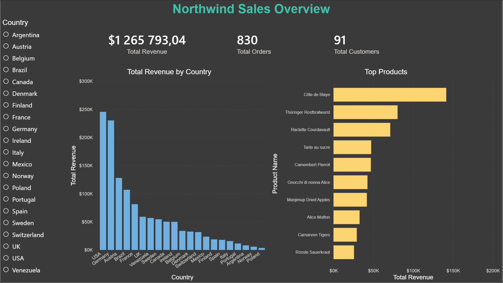
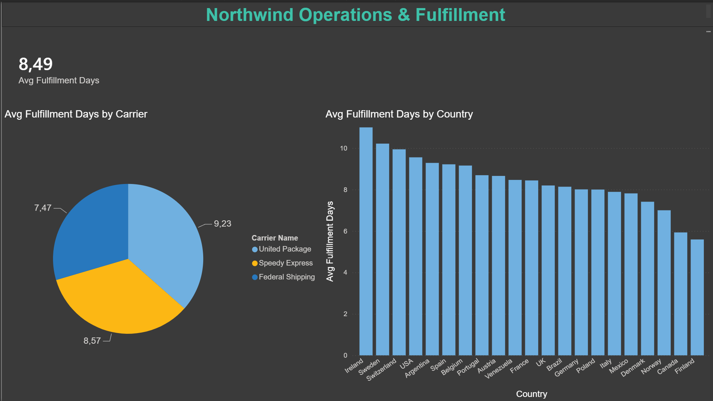

# Northwind SQL & Power BI Analysis

## Overview
An end-to-end data analysis project using the Northwind sample database - a fictional company that imports and exports specialty foods. This project explores sales performance and supply chain/order fulfillment metrics using SQL Server for data querying and Power BI for visualization.

## Dataset
Northwind is a Microsoft sample database simulating a trading company's orders, customers, products, employees, and suppliers.
- 91 customers, 830 orders, 2,155 order detail line items, 77 products
- 21 orders (~2.5%) had no recorded ship date and were excluded from fulfillment calculations

## Tools Used
- SQL Server Express / SSMS - data querying and validation
- Power BI Desktop - data modeling and dashboard visuals
- DAX - calculated measures
- GitHub - version control and portfolio hosting

## Business Questions
- Which customers generate the most revenue?
- How long does it take to fulfill an order from placement to shipment?
- Are some shipping carriers faster than others?
- Which products produces the most revenue?
- Which countries generate the most revenue?
- Who are the top-ranked customers by revenue?
- Does fulfillment speed vary by shipping destination?

## Key Findings
- Top revenue customers: QUICK-Stop, Ernst Handel, and Save-a-lot each generated over $100k in revenue
- Average order fulfillment time: 8.49 days (initially calculated as 8 days due to SQL integer rounding - corrected after cross-checking against Power BI's DAX calculation)
- Federal Shipping is the fastest carrier at 7.47 days average fulfillment, followed by Speedy Express 8.57 days and United Package 9.23 days
- Côte de Blaye is by far the top revenue-generating product at over $141,000 — more than 1.7x the second-highest product (Thüringer Rostbratwurst)
- USA and Germany are the top two markets by revenue ($245K and $230K), together generating nearly 37.6% of total revenue across all 21 countries
- Total revenue across all orders: $1 265 793.04
- Ireland has the slowest average fulfillment time (11 days across 19 orders), while Finland is fastest (5.59 days across 22 orders) — a notable gap that may warrant investigating regional logistics or carrier assignment differences

## SQL Queries
| File | Description |
|------|-------------|
| [`01_data_validation.sql`](sql/01_data_validation.sql) | Row count checks across core tables |
| [`02_revenue_by_customer.sql`](sql/02_revenue_by_customer.sql) | Total revenue and order count per customer |
| [`03_order_fulfillment_time.sql`](sql/03_order_fulfillment_time.sql) | Average days from order to shipment |
| [`04_fulfillment_by_carrier.sql`](sql/04_fulfillment_by_carrier.sql) | Average fulfillment time and order volume by shipping carrier |
| [`05_products_by_revenue.sql`](sql/05_products_by_revenue.sql) | Total revenue by product, ranked highest to lowest |
| [`06_revenue_by_country.sql`](sql/06_revenue_by_country.sql) | Total revenue by shipping destination country, including % of total revenue |
| [`07_total_revenue.sql`](sql/07_total_revenue.sql) | Grand total revenue across all orders |
| [`08_customer_revenue_rank.sql`](sql/08_customer_revenue_rank.sql) | Customers ranked by total revenue using RANK() window function |
| [`09_fulfillment_by_country.sql`](sql/09_fulfillment_by_country.sql) | Average fulfillment time and order volume by shipping country |


## Project Structure
```
northwind-sql-powerbi-analysis/
│
├── sql/
│   ├── 01_data_validation.sql
│   ├── 02_revenue_by_customer.sql
│   ├── 03_order_fulfillment_time.sql
│   ├── 04_fulfillment_by_carrier.sql  
│   ├── 05_products_by_revenue.sql
│   ├── 06_revenue_by_country.sql
│   ├── 07_total_revenue.sql
│   ├── 08_customer_revenue_rank.sql
│   └── 09_fulfillment_by_country.sql
│
├── powerbi/
│   └── northwind_dashboard.pbix
│
├── screenshots/
│   ├── sales_overview.png
│   └── operations_fulfillment.png
│
└── README.md
```
## Dashboard Preview

### Sales Overview


### Operations & Fulfillment


## Business Analytics Profile
This project demonstrates practical SQL and Power BI skills applied to a realistic business scenario.

Key strengths demonstrated:
- SQL: joins, aggregation, subqueries, window functions (RANK), date logic
- Power BI: data modeling, DAX measures, interactive dashboards with slicers and cross-filtering
- Data validation and error-checking (e.g. identifying and correcting a rounding discrepancy between SQL and DAX)
- Translating business questions into clear, measurable findings